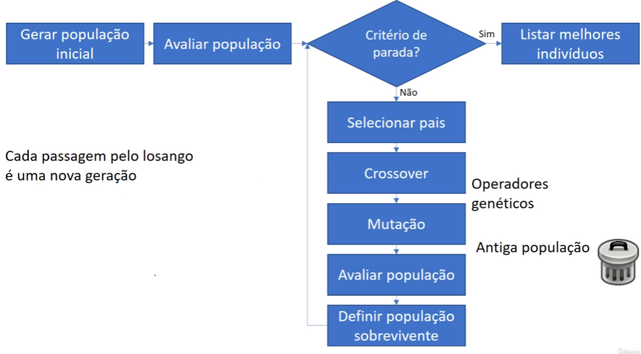
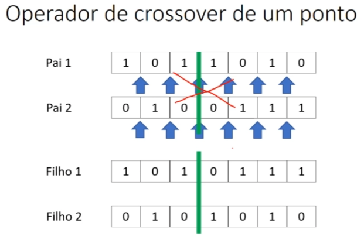

# Algoritmos Genéticos

### Algoritmos evolucionários e algoritmos genéticos

**Algoritmos evolucionários (EA - evolutionary algorithm)**
- Modelos computacionais dos processos naturais de evolução.
- Simulação da evolução das espécies.
- Sobrevivência do mais apto.
- Auto organização, comportamento adaptativo.

**Algoritmos genéticos**
- Ramos dos algoritmos evolucionários.
- Soluções cada vez melhores a partir da evolução das gerações anteriores.
- Redes neurais.
- - Os algoritmos genéticos são muito utilizados em combinação com redes neurais artificiais.
- - O algoritmo *back-propagation*, que existe para encontrar os melhores pesos de uma rede neural utilizam conceitos de algoritmos genéticos.
- Não somente são usados para resolver problemas do mundo real, mas também para auxiliar outros algoritmos de Machine Learning.

#### Fluxo de um algoritmo genético:



## Características dos algoritmos genéticos

### Indivíduo
- Indivíduos representam as soluções.
- Cada indivíduo vai representar uma solução específica para o problema e cabe a nós definir qual deles representa a melhor solução.
- **Um conjunto de indivíduos formam uma população**.
- O **cromossomo representa uma solução para o problema**.
- O indivíduo pode ser o próprio cromossomo na maneira mais simples possível, ou pode conter o cromossomo como atributo.

Exemplo, para os objetos Celular, Caderno, Livro e Notebook é necessário colocar em uma mochila de tamanho X estes objetos, porém a mochila não cabe todos. Assim como, vamos supor que seja necessário ter os objetosmais caros nessa mochila, então quais objetos seriam podem ser escolhidos, que sejam os mais caros e que caibam na mochila?

Cada item do array *cromossomo* abaixo se chama **gene**.
```py
    cromossomo = [ # Cromossomo
        ['Celular', 0], # Gene
        ['Caderno', 1], # Gene
        ['Livro', 0], # Gene
        ['Notebook', 1] # Gene
    ]
```

Um cromossomo nada mais é do que um conjunto de respostas, onde nesse contexto há valores 0 ou 1 para alguns objetos que podem significar uma solução de objetos que serão levados e os que não serão levados.

Ou seja, cada indivíduo da população é uma possível resposta para o problema sendo resolvido, geralmente representado por um cromossomo, que codifica os parâmetros ou variáveis da solução.

**Cada indivíduo da população é composto por um único cromossomo, ou seja, um indivíduo é uma solução, e seu cromossomo é a forma como essa solução está representada internamente.** Durante o processo evolutivo, os cromossomos são cruzados e modificados, originando, assim, novos indivíduos que compõem a próxima geração.

### Função de avaliação (**fitness**)

A função de avaliação (também chamada de **função de aptidão**, fitness function) é o mecanismo central de avaliação em um algoritmo genético. Ela **mede a qualidade de cada indivíduo da população**, atribuindo um valor que representa o quão boa é a solução representada por seu cromossomo em relação ao objetivo do problema. Esse valor é essencial para guiar o processo evolutivo, pois determina quais indivíduos têm maior chance de serem selecionados para reprodução.

Cada indivíduo é avaliado por meio da função de aptidão, que mede a qualidade da solução. No final do processo, o algoritmo retorna o indivíduo com o maior valor de fitness, ou seja, a melhor combinação testada.

Resumindo:

- Medida de qualidade para saber como o cromossomo resolve o problema.
- Se é uma solução aceitável e se pode ser utilizada para a evolução.

A forma exata da função de avaliação depende do contexto do problema: pode ser uma função a ser maximizada (como por exemplo, lucro, acurácia ou eficiência), ou transformada em um critério de maximização, mesmo sendo em problemas de minimização, como por exemplo, erro (erro quadrático médio) ou custo (função de custo/perda de uma rede neural).

### Crossover/reprodução (Cruzamento)

Na parte de cruzamento de um algoritmo genético, basicamente uma parte do gene de um indivíuo é combinado com uma parte do gene de outro indivíduo, com isto é gerado um descendente (filho) para a próxima geração com as características dos 2 indivíduos. 



- É definido um ponto de corte que definirá quais **genes** serão cruzados com os de outro indivíduo.
- Combina pedaços do cromossomo de dois genitores gerando filhos mais aptos e consequentemente com o passar das gerações a população tende a evoluir.